# Synthetic controls at The Data City

Progress in our July fellowship project.

## 1\. Synthetic Brexit

We started our project by reproducing the [synthetic control methods for estimating the economic impact of Brexit](https://consoc.org.uk/publications/the-economic-impact-of-brexit/) on the UK economy. This method assembles a synthetic control (doppelganger) of the UK from a weighted sum of other countries. The synthetic control performed near-identically to the UK before 2016 and we might expect Britain to have performed like the synthetic control had it not left the EU. By comparing the performance of the synthetic control with the real performance of Britain since 2016 we can estimate the cost of Brexit to the UK economy.

We were able to reproduce published results using our own methods well.
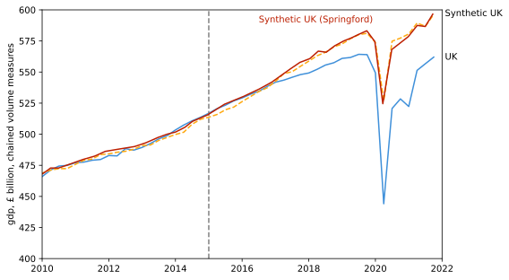
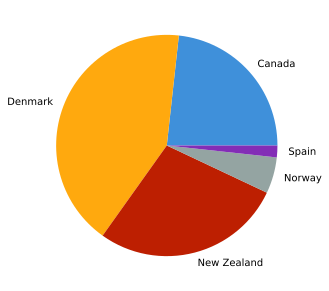

The [data on the donor set](https://www.cer.eu/file/gdp7622xlsx) is % GDP growth year on year, as used by and provided by Springford. We wrote our own algorithm for it. Our statistical method drops 3 countries (Greece, Iceland and Ireland) from the donor set due to poor fit with the set, and the p-value calculated is p=0.053, significant at the 10% level. This suggests that it is unlikely that the discrepancy in the UK economy occurred by chance.

In the end, there were two things that ended up mattering a lot,

- Libraries for implementing the synthetic control method.
- Donor sets. The group of countries from which the synthetic control was assembled.

In python, we used synthdid and mlsynth before opting to write our own algorithm using the scipy.optimize package. This gave us more control over weightings & constraints, and a deeper understanding of uncertainty analysis and donor set exclusion.

Our best estimate synthetic control for the UK gave similar results to those in John Springford’s work with quite a different composition of countries than he reported. This is probably quite a good sign for the robustness of his findings.

Having reproduced a published and highly scrutinised output we applied our techniques to a new problem.

## 2\. Synthetic Scotland built from UK regions donor set

In 1997 Scotland voted to recreate a Scottish Parliament to administer substantial political and economic powers returned to Scotland in 1999. We wanted to test if synthetic control like those used to evaluate the economic impact of Brexit could be used to evaluate the economic impact of Scottish devolution.

Our first efforts used [economic data](https://www.escoe.ac.uk/regionalnowcasting/) on % GDP growth for other regions of the UK to build a synthetic control. The results were, as previously found in less rigorous analysis, that the Scottish economy has outperformed since devolution.

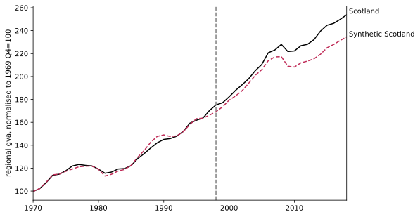
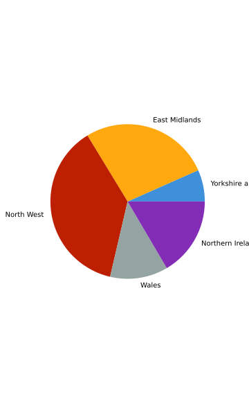

But applying [methods for uncertainty analysis](https://www.mit.edu/~jhainm/Paper/ccs.pdf), we can show that this result is not statistically significant with a p-value of 0.5 suggesting that it could just as likely be the result of chance as being a real effect.

We carried out further analysis of Scottish devolution using [real GDP/capita at current values PPS](https://territorial.ec.europa.eu/ardeco/viewer/234513?jdvfys=asc&jdvfc=eu&jdvfnl=1&jdvnutsv=2021&jdvfs=UKM) (and [population statistics](https://territorial.ec.europa.eu/ardeco/viewer/SNPTD)) which showed minimal influence of devolution as well, with a slightly different synthetic control group.

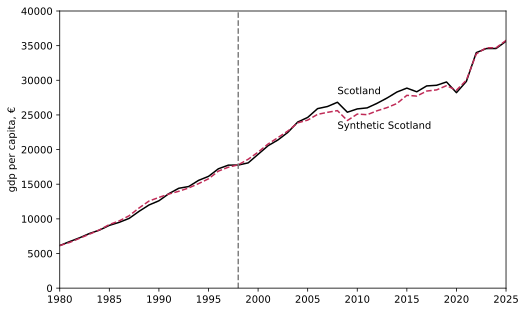

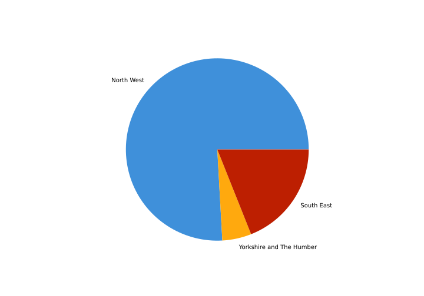

## 3\. Synthetic Scotland built from EU NUTS1 regions (ARDECO) donor set

As a further extension to devolution, we considered building synthetic Scotland from EU NUTS1 regions as well as the UK regions. Pre-covid Scotland appears to outperform it’s counterfactual but again, the calculated p-value of 0.89 suggests that this is likely chance as much as it is the effect of devolution, within the reference frame of EU regions. Synthetic Scotland here ends up being composed of more units than without the EU regions, with one common donor being Yorkshire and the Humber. In this approach, of course, it's likely that different EU regions have different levels of devolution which may contribute the reduced relative effect of devolution in Scotland.

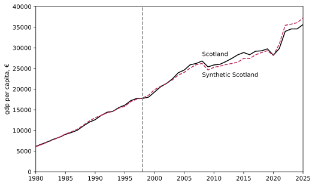

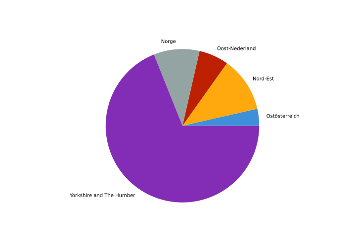

## 4\. Synthetic Northern Ireland built from EU NUTS1 (ARDECO) regions donor set
As a different example of a policy change, let’s think about the regional effect of Brexit in the UK. The majority of the UK exited the single market at the end of 2020, whilst Northern Ireland remains in the customs union. The [Northern Ireland Protocol](https://www.legislation.gov.uk/eut/withdrawal-agreement/attachment/1/adopted) keeps NI aligned with the single market, avoiding a hard border on the island of Ireland. As such, we might expect that Northern Ireland should behave similarly to EU regions economically. We begin by modelling NI out of the set of EU NUTS1 regions, excluding other UK regions. There’s only 2 years of post-NIP data, but it suggests that NI has performed below the EU since 2021. The statistical analysis of this gives a p-value of p=0.11, suggesting that at the 10% confidence level this may be due to chance.

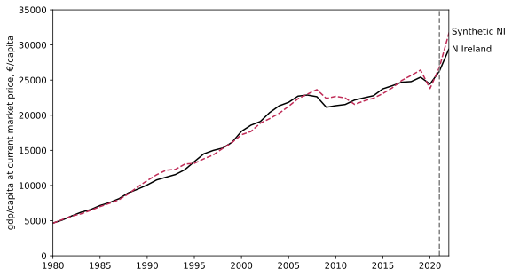

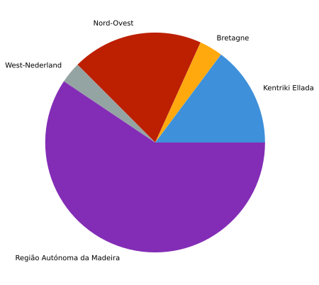

## 5\. Synthetic Northern Ireland built from UK regions (ARDECO, NUTS1) donor set

We can of course look at Northern Ireland from the perspective of UK regions. We might expect that remaining in the customs union would change the economic growth of NI relative to the rest of the UK. Our synthetic NI appears to show some additional growth to the Northern Irish economy relative to the synthetic NI. However, statistical analysis yields a p-value=0.5 suggesting that this growth is just as likely down to chance as down to the intervention of the NIP, at least in the effect on GDP/capita.

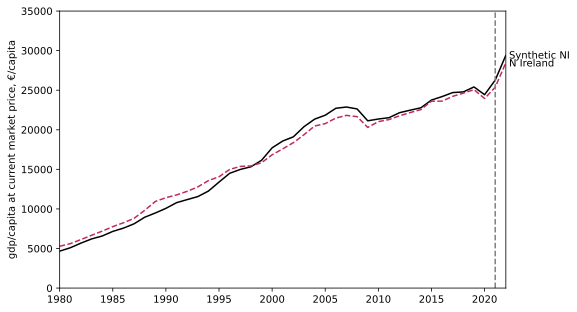

## 6\. Synthetic Company: Dassault Systèmes

The Data City has five years of financial data (employee estimates, turnover estimates, and more) for most active UK companies in our Industry Engine product. Because we have been operating for seven years, we have more years of financial data for hundreds of thousands of companies going back to 2016. This is a large donor set of companies from which to build a synthetic company.

As an example, we begin by modelling growth at Dassault systèmes from a group of similar companies. We select the proxy for growth as number of employees, this is reported in accounts for each accounting period and where it is not; we have methods of prediction by curve fitting, as well as extrapolation to 2025.

We have an index for company similarity, so we select the 50 companies that are most like Dassault systèmes and then filter out companies which have missing data, arriving at a donor set of 41 companies. We run our algorithm for the synthetic company, plotted below assuming an ‘intervention’ in 2023. This is a placebo test as we have no reason to believe that Dassault would not conform to the broad economic trends that effect its most similar companies. The placebo nature of this is reflected in the broad agreement of the employment trend with an accompanying p-value of 0.88 suggesting that the variation between the two is likely down to chance. Synth Dassault is composed of Mettler-Toledo Safeline X-Ray Limited, Smart Metering Systems Limited, Cloudfactory Holdings Limited and Schlumberger Oilfield UK Limited.

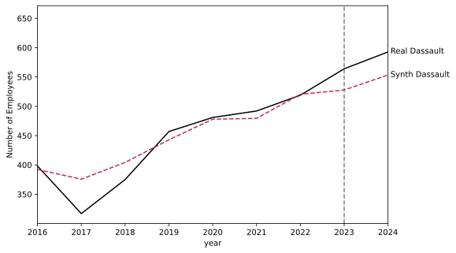

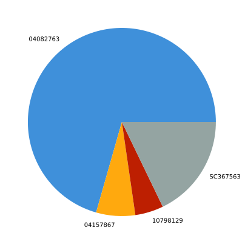

We started this project thinking about the well-measured impact of the BBC moving to Salford Quays on the surrounding economy, especially in related sectors. Since this move happened in 2011, we have no data on company level performance, and we started thinking about similar more recent interventions.

## 7\. Synthetic creative industries sector in Leeds following Channel 4 relocation

In 2018 [Channel 4 selected Leeds](https://www.bbc.co.uk/news/entertainment-arts-46032962) as the location for its new headquarters and it [had made substantial progress on relocation in late 2019](https://www.bbc.co.uk/news/entertainment-arts-50068525) though Covid meant the process only [completed in 2021](https://www.theguardian.com/media/2021/sep/05/channel-4-opens-new-hq-in-leeds-as-it-fights-against-privatisation). One argument in favour of moving a substantial part of Channel 4 out of London was to stimulate employment growth in the creative industries in more of the country.

If this were working as intended, we would expect employment in creative industries to have grown more quickly in Leeds than in the other candidate cities of the UK. Did we?

The Data City has three RTICs, [Streaming Economy](https://thedatacity.com/rtics/streaming-economy-rtic0060/), [Digital Creative Industries](https://thedatacity.com/rtics/digital-creative-industries-rtic0064/), and [Media and Publishing](https://thedatacity.com/rtics/media-and-publishing-rtic0068/), made up of twenty one detailed sector verticals containing a total of 25,050 companies in August 2025. Of these we have financial data of a sufficient quality for ten years for 13,170 companies, easily enough to create a synthetic control of each company.

We started by aggregating companies by location. We assumed that a company and its employees are located at the registered address, and that this has been its registered location throughout the time frame of the analysis. The exact number of companies in Leeds thus depends on the level of aggregation chosen. Companies that ceased to trade during this time frame are not included in this data.

### By local authority aggregation

As a start, we can aggregate the number of employees in our creative industries by their location. This is aggregated by the location of their registered address. There are 358 local authorities (including Leeds) represented in the 3 RTICS we’ve focused on.

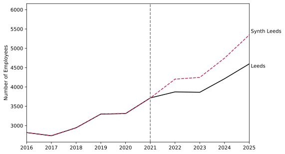

Aggregating by LA, and using all 357 LAs, results in an overfit Leeds, partly because there are 357 contributing LAs which allows us a high chance of finding an exact fit. This could be reduced by using covariates such as information about the make up of the creative industries in each region. Perhaps building each vertical out of that vertical in other LAs. For now, we'll try fitting to city-based LAs only.

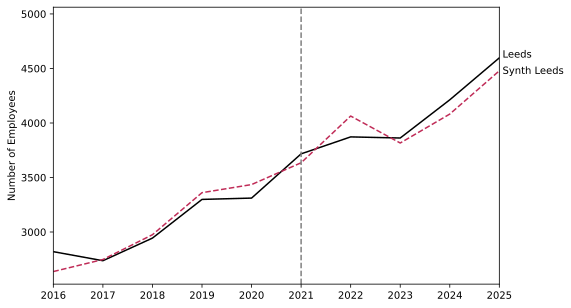

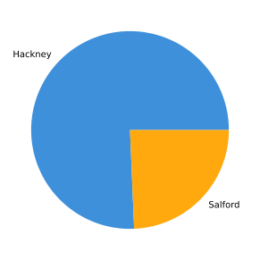

This results in a fairly good match between Leeds and its synthetic counterpart across all times without being overfit earlier. Statistically, we can calculate a p-value p=0.95, and also by eye we can see minimal influence of Channel 4 on Leeds.

### Assessing Channel 4 company by company

What if we wanted to assess the effect of Channel 4 on a company by company basis? This is a bit harder, and of course we must choose what Leeds means like we did above. We exclude from the donor set companies which have an operating location in Leeds, in an effort to remove spillover effects to those companies.
One thing to note is that we can’t model companies that didn’t exist before 2021, so we lose some companies to this. We opted to model the 201 companies which have existed for the full duration 2016-2025 in the local authority of Leeds, and have a reported employee count each year.

We also relaxed some constraints such as the requirement of the weights to sum to one, allowing us to build a company out of multiple similar companies. Instead, we chose to bound the maximum weight of any company between \[0,1\] but any number of companies can contribute to the synthetic control. Each company is produced from a donor set of the 20 most similar companies in the 3 RTICS_,_ based on a composite similarity score which accounts for rough company size, sector and geographical overlap.

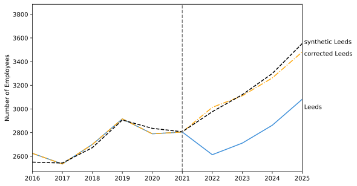

**Why does employment in the Creative Industries appear to fall so sharply in 2022?**

- Primarily due to reallocation of ~400 employees by Emerald Group Holdings in 2022 to a newly established holding company that we cannot model using the company by company approach. This doesn't arise in the aggregated approach as both companies can be included. Correcting this discrepancy shows good agreement with the synthetic control built out of synthetic companies, but it’s not really automatable.
- Brings in considerations that we cannot model newly established companies with SCM going company by company, and we also don’t have the companies that ceased to trade in the data set either. There’s survivorship bias. 
- A brief look at the data we have tells us that there are 144 companies that incorporated in Leeds after 2016 in the sector with an estimated 1080 total employees in 2025 (inc the 400 at Emerald), who are accounted for in the LA aggregated method. Tracing whether all these are reallocations or new employment is tricky.
- We expect that issues similar to this will effect companies in our donor sets too. Weeding these out is as tricky.

Companies have been dropped from the treated set, for a poor fitting synthetic, using a threshold for the variance of the synthetic from the observed data over the fitting period. We remove a company with $rmpse_{norm}>0.15$, unless the company has an average of 10 employees or less over the fitting period. These thresholds were chosen heuristically to remove the very poorly fit companies.

$$ rmpse_{norm}=\sqrt{\frac{\sum_t(y_{fit}-y_{obs})^2}{\bar y_{obs}^2}}$$

In this approach, 7 companies are dropped for having a poor fit. Again, this tends to come down to ‘noisy’ behaviour from companies in the training period, for example one subsidiary of Jaywing (01677363) is allocated 250 employees in both 2019 and 2020, but only ~19 in all other years. This is atypical behaviour that we just cannot account for. This is a good identifier of companies that aren’t following typical behaviour.

**Challenges in modelling company by company**

- We had to relax the requirement that the sum of the weights = 1 in order to build larger companies out of their smaller similar companies. Not doing this resulted in systematic underprediction beforehand.
- Some companies have unexpected things happen to them before 2022, and those aren’t necessarily things our donors can model. Aggregating the companies reduces the noise that these events create.

**How can we evaluate the statistics of the aggregate of the synthetic companies?**

- There are no formal statistical methods available in literature that deal with the combined 201 synthetic companies created. The p-value method can be used per company, but with each having it's own donor set, combining these for sensible inference isn't really practical. 

**How do we choose the best donor to model from if they have the same trajectories?**
- Unlike aggregated data it wouldn’t be unusual for a company in the donor set and one in the treated set to have the exact same trajectory, particularly small companies of 1-5 employees. The scoring system we have used on regional data wouldn’t be appropriate here.
- Just as a treated and a donor company can have the same employment data, there are companies in the donor set which have the same employee data as each other in the training period (this may or may not continue in the prediction). Picking the best of these would require covariates to match upon too. Are there consistent predictors of whether a small company grows or shrinks?

